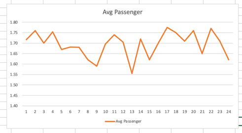

# maruths-Taxi
 
'''Question 1 - What datetime range does your data cover? How many rows are there total
       
       Number of rows in the dataset: 14776615
       Time Range 2013-01-01 00:00:00 between 2013-02-01 10:33:08 '''

''Question 2 - What are the field names?  Give descriptions for each field.
      
    ['medallion', 'hack_license', 'vendor_id', 'rate_code', 'store_and_fwd_flag', 'pickup_datetime', 'dropoff_datetime', 'passenger_count', 'trip_time_in_secs', 'trip_distance', 'pickup_longitude', 'pickup_latitude', 'dropoff_longitude', 'dropoff_latitude']
''

''Question 3 - Give some sample data for each field.
            
    ['medallion', 'hack_license', 'vendor_id', 'rate_code', 'store_and_fwd_flag', 'pickup_datetime', 'dropoff_datetime', 'passenger_count', 'trip_time_in_secs', 'trip_distance', 'pickup_longitude', 'pickup_latitude', 'dropoff_longitude', 'dropoff_latitude']
    ['89D227B655E5C82AECF13C3F540D4CF4', 'BA96DE419E711691B9445D6A6307C170', 'CMT', '1', 'N', '2013-01-01 15:11:48', '2013-01-01 15:18:10', '4', '382', '1.00', '-73.978165', '40.757977', '-73.989838', '40.751171']
    ['0BD7C8F5BA12B88E0B67BED28BEA73D8', '9FD8F69F0804BDB5549F40E9DA1BE472', 'CMT', '1', 'N', '2013-01-06 00:18:35', '2013-01-06 00:22:54', '1', '259', '1.50', '-74.006683', '40.731781', '-73.994499', '40.75066']
    ['0BD7C8F5BA12B88E0B67BED28BEA73D8', '9FD8F69F0804BDB5549F40E9DA1BE472', 'CMT', '1', 'N', '2013-01-05 18:49:41', '2013-01-05 18:54:23', '1', '282', '1.10', '-74.004707', '40.73777', '-74.009834', '40.726002']
    ['DFD2202EE08F7A8DC9A57B02ACB81FE2', '51EE87E3205C985EF8431D850C786310', 'CMT', '1', 'N', '2013-01-07 23:54:15', '2013-01-07 23:58:20', '2', '244', '.70', '-73.974602', '40.759945', '-73.984734', '40.759388']
    ['DFD2202EE08F7A8DC9A57B02ACB81FE2', '51EE87E3205C985EF8431D850C786310', 'CMT', '1', 'N', '2013-01-07 23:25:03', '2013-01-07 23:34:24', '1', '560', '2.10', '-73.97625', '40.748528', '-74.002586', '40.747868']
''

''Question 4 - What MySQL data types / len would you need to store each of the fields?

    medallion - varchar(50)
    hack_license - varchar(50)
    vendor_id - varchar(5)
    rate_code - int(1)
    store_and_fwd_flag - bool
    pickup_datetime - datetime
    dropoff_datetime - datetime
    passenger_count - int
    trip_time_in_secs - int
    trip_distance - decimal(2,2)
    pickup_longitude - decimal(2,6)
    pickup_latitude - decimal(2,6)
    dropoff_longitude - decimal(2,6)
    dropoff_latitude - decimal(2,6)
''

''Question 5 - Considered coordinates between -99 to 99

    Min and Max of Pickup_Longitude :-98.866356 and 80.842125 
    Min and Max of Pickup_Latitude :-39.762348 and 82.514046 
    Min and Max of dropoff_Longitude :-98.75 and 84.315735 
    Min and Max of dropoff_Longitude :-0.56333297 and 83.516693 
''

'' Question 6: 
''

''Question 7: What are the distinct values for each field? (If applicable)
    
    {'vendor_id': ['CMT', 'VTS'], 'rate_code': ['1', '2', '4', '5', '3', '6', '8', '0', '210', '28', '7', '9', '65', '128'], 'store_and_fwd_flag': ['N', 'Y', ''], 'passenger_count': ['4', '1', '2', '3', '5', '6', '0', '208', '9', '255']}
''

'' Question 8

    {'passenger_count': {'min': 0, 'max': 4.0}}
    {'trip_time_in_secs': {'min': 0, 'max': 382.0}}
    {'trip_distance': {'min': 0, 'max': 1.0}}
''

''Question 9 

    {'15': 1.7161581455566817, '00': 1.7674645758797922, '18': 1.7012934622800804, '23': 1.7540406583168833, '11': 1.6736848030241087, '12': 1.6811567347356455, '13': 1.688445186465027, '09': 1.6280298565816753, '07': 1.5957135230796233, '14': 1.695371301700947, '22': 1.7441527481804624, '17': 1.7042513525845773, '06': 1.5543789390756302, '21': 1.723739471842693, '08': 1.6261664483250076, '19': 1.7074959246849928, '03': 1.7749906599564864, '04': 1.7498726500909643, '20': 1.7098300345053143, '01': 1.7650990993235585, '10': 1.6598250438604478, '02': 1.7715300962533436, '16': 1.7186234442907942, '05': 1.620607966457023}

''

''Question 10

    Created 14776 separate file - Uploaded only the last file split_file_14776.csv

''